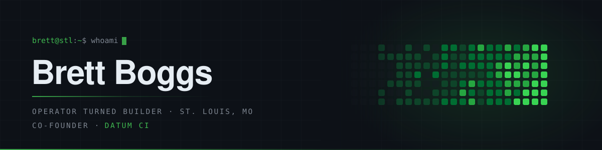

<div align="center">

<picture>
  <source media="(prefers-color-scheme: dark)" srcset="./assets/banner-dark.svg">
  <source media="(prefers-color-scheme: light)" srcset="./assets/banner-light.svg">
  
</picture>

<br>

**Ten years in operations. Now I build the software I wished I had.**

<br>

<a href="https://brettboggs.dev"></a>
<a href="https://linkedin.com/in/brettmboggs"></a>
<a href="mailto:brettmboggs@gmail.com"></a>
<a href="https://datumci.com"></a>

</div>

<br>

```console
$ brett --now

  ▸ Datum CI          multi-tenant construction ops SaaS · co-founder, product engineering
  ▸ apparent-low      LLM extraction agent + eval harness for state DOT bid tabulations
  ▸ brettboggs.dev    portfolio and lab · Astro 5 on GitHub Pages
  ▸ Providence Cap.   real estate operations · the day job that taught me the domain

$ brett --why

  I ran a Honda service lane, then car wash sites, then real estate ops.
  Ten years of tools that demanded data entry nobody had time for and
  answered questions nobody asked. So I learned to build the other kind.
```

<br>

## ◆ Selected work

<table>
<tr>
<td width="50%" valign="top">

### [apparent-low](https://github.com/brettmboggs/apparent-low)
`TypeScript` · `Node 20` · `Claude headless`

An extraction agent **and** the eval harness that proves it works. Turns messy state DOT bid tabulation PDFs into structured JSON — bidder rankings, itemized schedules, unit pricing.

The interesting part is the scoring: structural pairing by item code and line number, recall and precision kept separate, errors weighted by dollar impact, arithmetic self-verification against the document's own math. Frozen corpus, versioned prompts, reproducible runs.

</td>
<td width="50%" valign="top">

### [brettboggs.dev](https://github.com/brettmboggs/brettboggs.dev)
`Astro 5` · `TypeScript` · `GitHub Actions`

Portfolio, lab, and writing. Static by choice — no CMS, no platform lock-in, deploy on push.

### [Datum CI](https://datumci.com) <sub>`private`</sub>
`React` · `TypeScript` · `Azure Functions` · `Azure SQL` · `MSAL/Entra`

Multi-tenant construction operations platform, live with a heavy-civil GC in St. Louis. Projects, Estimating, Field Ops, and PM modules. Kanban with optimistic updates and rollback, RFI workflows with SAS-scoped attachments, tenant-isolated data access, migrations as immutable versioned files.

</td>
</tr>
</table>

<br>

## ◆ Stack

|  |  |
|---|---|
| **Build** | `TypeScript` &nbsp;`React` &nbsp;`Node 22` &nbsp;`Vite` &nbsp;`Astro 5` &nbsp;`Swift` |
| **Run** | `Azure Functions` &nbsp;`Azure SQL` &nbsp;`Static Web Apps` &nbsp;`Key Vault` &nbsp;`Entra ID / MSAL` &nbsp;`GitHub Actions` |
| **Leverage** | `Claude Code` &nbsp;`MCP` &nbsp;`Playwright` &nbsp;`Context7` &nbsp;`Figma` |
| **Shape of the work** | `multi-tenant` &nbsp;`RBAC` &nbsp;`optimistic UI` &nbsp;`versioned migrations` &nbsp;`LLM evals` |

<br>

## ◆ How I work

> **AI-native, not AI-credulous.** I build with agents in the loop — Claude Code, MCP servers, eval harnesses. I also assume the output is wrong until something proves otherwise, which is why `apparent-low` is half agent and half scoring rig.

> **CI green ≠ works on screen.** Every visual change gets clicked on the deployed site after the pipeline passes. A build that compiles and a feature that works are two different claims.

> **Constraints come from the field, not the backlog.** Software for a construction crew has to survive a foreman's morning, a month-end close, and a bid due at 10 a.m. That's the spec.

> **Ship in small, reversible pieces.** Optimistic updates with rollback, immutable date-prefixed migrations, per-environment config documented before the second environment exists.

<br>

## ◆ The last twelve months

<div align="center">


<sub>Most of the volume lives in private repos — Datum CI ships from a closed org.</sub>

</div>

<br>

## ◆ Before software

Ten years running things that break in public. Service advising at **West County Honda** — writing repair orders against a clock with a customer standing there. Multi-site operations at **Tidal Wave Wash Centers** — labor, throughput, equipment uptime, and the P&L that follows all three. Now operations at **Providence Capital**, a real estate investment firm.

Every one of those jobs was the user of somebody's bad software. That's the whole reason I'm on this side of it.

<br>

<div align="center">

## ◆ Reach me

**[brettboggs.dev](https://brettboggs.dev)** · **[LinkedIn](https://linkedin.com/in/brettmboggs)** · **[brettmboggs@gmail.com](mailto:brettmboggs@gmail.com)**

<br>

<sub>Open to conversations about product engineering, applied AI, and construction / operations software.</sub>

<br>


</div>
